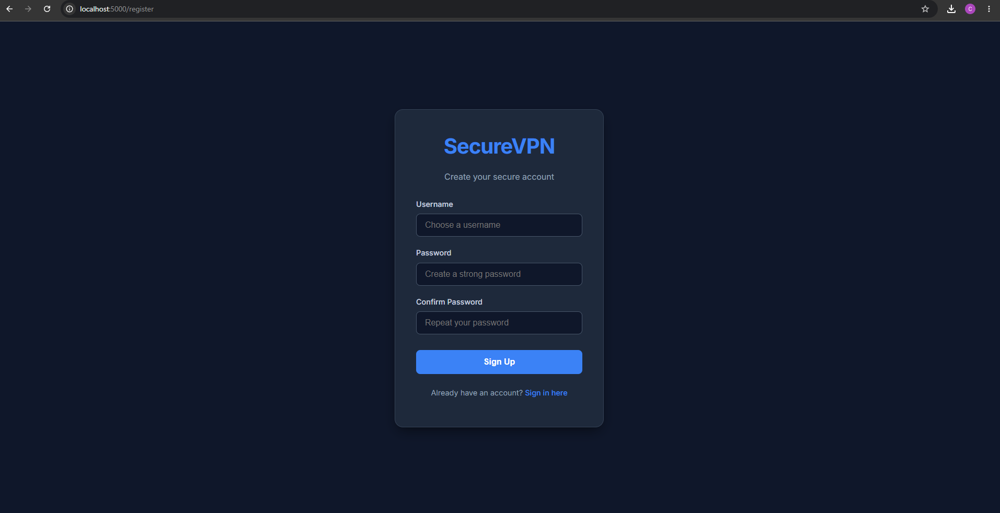
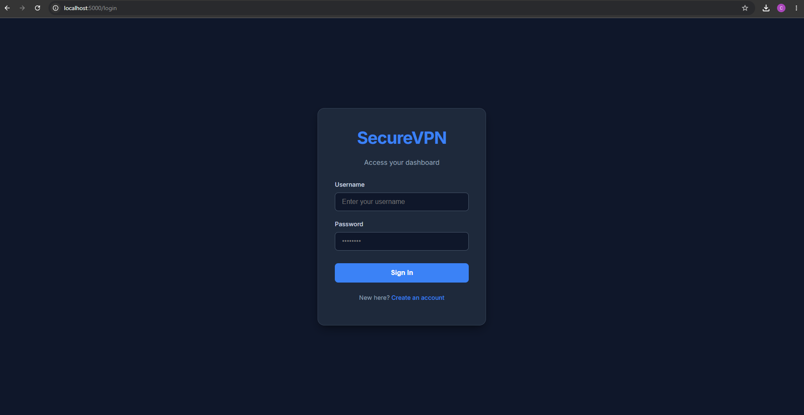
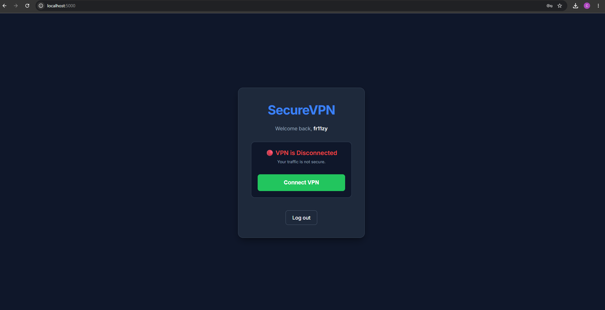
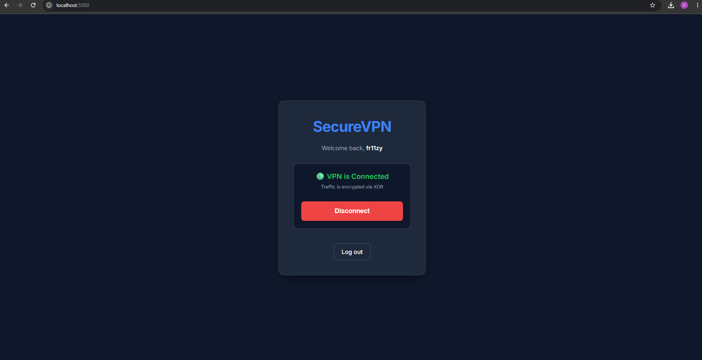

# DevCSApplications (VPN Service)

Учебный проект клиент-серверного VPN-сервиса на Python, который разделён на веб-интерфейс для работы с пользователями и vpn-часть, разделённую на клиента и сервер.

## Скриншоты web-приложения
### Страница регистрации
  

### Страница авторизации
  

### Панель управления (VPN Disconnected)
  

### Панель управления (VPN Connected)
  

## Стек

* **Python 3**
* **Flask** 
* **SQLite + PyYAML** 
* **socket, threading, fcntl, os, struct, subprocess** 
* **Docker / Docker Compose**

## Web-часть
Позволяет пользователям регистрироваться, входить в систему и одной кнопкой запускать процесс подключения к серверу.

## VPN-часть
Скрипт `vpn.py `, который может работать как в режиме сервера, так и в режиме клиента в зависимости от выбора mode с которым запускать.
Включение скрипта работает через библиотеку `subprocess`, которая позволяет запустить его из кода.

## Структура проекта

### Основные файлы
* `main.py` — инициализация базы данных и создание таблиц по схеме.
* `config.yaml` — схема структуры таблиц БД.
* `db.sqlite` — локальный файл базы данных SQLite.
* `docker-compose.yml` — Файл для одновременного запуска всех частей проекта (веб и сервер).

### База данных
* `database/db.py` — работа с SQLite (`execute`, `fetchone`, `fetchall`).
* `models/dbo.py` — Базовый класс ORM для выполнения CRUD-операций.
* Сгенерированные модели: `models/users.py`, `models/roles.py`, `models/permissions.py`.

### Генерация моделей
* `generators/codegen.py` — Скрипт, который автоматически генерирует Python-классы моделей на основе `config.yaml`.

### Web-интерфейс
* `web/app.py` — Основное Flask-приложение.
* `web/templates/` — HTML-шаблоны (login, register, main).
* `web/static/` — CSS-стиль.

### VPN-часть
* `vpn.py` — cодержит логику создания TUN-интерфейсов, алгоритм шифрования XOR, работу с UDP-сокетами и два режима запуска (`server` и `client`).

## Как работает авторизация

1. Пользователь регистрируется через веб-интерфейс. Flask хэширует пароль (`pbkdf2:sha256`) и записывает данные в SQLite.
2. При нажатии кнопки "Connect" в браузере, запускается процесс клиента. Он отправляет `username` и `password` на VPN-сервер по UDP.
3. Сервер принимает данные, проверяет их по базе `db.sqlite` и сверяет хэш.
4. Если данные верны, сервер отвечает `AUTH_OK`, и процесс подключения продолжается.

## Как работает туннель

После успешной авторизации:
1. Клиент и сервер создают виртуальные интерфейсы (`tun1` для клиента, `tun0` для сервера).
2. Запускаются два фоновых потока.
3. **Поток 1:** Читает перехваченные IP-пакеты из интерфейса `TUN`, шифрует их (с помощью `XOR`) и отправляет через сокет `UDP`.
4. **Поток 2:** Принимает зашифрованные пакеты по `UDP`, расшифровывает их обратно через `XOR` и записывает в `TUN`.

## Подготовка окружения

Для корректной работы туннелей (`/dev/net/tun`) приложению нужны системные привилегии `NET_ADMIN` для того, чтобы web-приложение могло запускать скрипт `vpn.py` с mode=client.

Базовый образ `Fedora 40` из папки `.devcontainer` автоматически устанавливает `python3`, `flask`, `sqlite` и сетевые утилиты (`iproute`).

## Запуск проекта

При первом запуске необходимо создать файл базы данных. 
```bash
python3 main.py
```
Затем просто запускаем и собираем два сервиса Flask и VPN-Server, который будет принимать трафик от VPN-Client
```bash
docker-compose up -d --build
```
Для просмотра логов используем:
```bash
docker-compose logs -f
```
Таким образом, у нас уже создана БД, запущено web-приложение с авторизацией и регистрацией и VPN-сервер, готовый принимать трафик. VPN-клиент будет запускаться при нажатии кнопки 'Connect' и связываться с сервером, передавая данные пользователей для проверки в БД.

